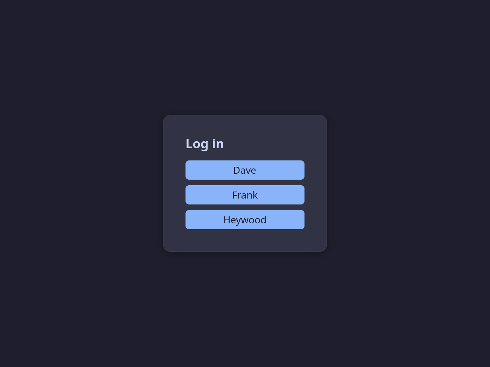
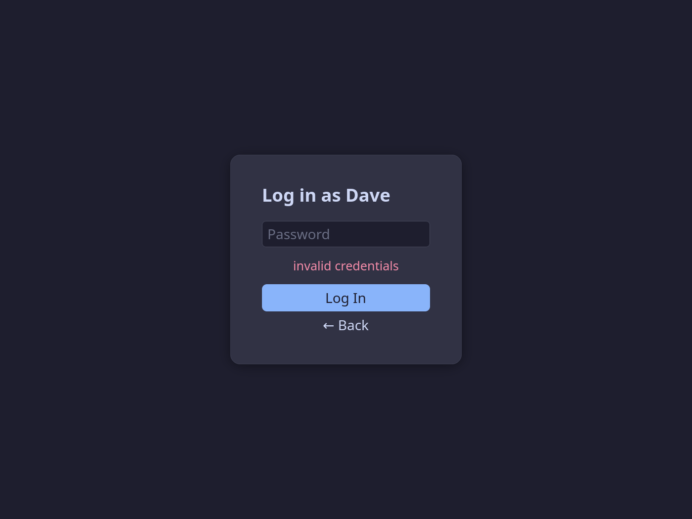

# atrium

A lightweight display manager, built for Linux multiseat setups. Discovers seats
via logind, shows a greeter on each seat, handles user authentication, and hands
off to an independent user session per seat.

<!-- markdownlint-disable MD001 -->
### Screenshots
<!-- markdownlint-disable MD001 -->

<table align="center">
  <tr>
    <td align="center" width="33%">
      <a href="doc/screenshots/login.png">
        </a><br>
      <sub>Greeter with default theme</sub>
    </td>
    <td align="center" width="33%">
      <a href="doc/screenshots/password.png">
        </a><br>
      <sub>Password entry</sub>
    </td>
    <td align="center" width="33%">
      <a href="doc/screenshots/ghibli.webp">
        </a><br>
      <sub>Ghibli theme</sub>
    </td>
  </tr>
</table>

### Why atrium?

The Linux kernel and low-level system stack are fully capable of multiseat
operation: udev handles device assignment, logind manages independent user
sessions per seat, and Wayland compositors work with whatever devices logind
gives them. The weak link has always been the display manager. Existing ones
usually treat multiseat as an afterthought, with implementations that are
brittle and difficult to get working reliably.

atrium is designed around multiseat from the start, focusing on correct seat
discovery, VT handling, and isolated session management. The project targets a
modern Linux stack using systemd/logind, PAM, and a Wayland graphical
environment. The lack of historical baggage keeps atrium's code base lean and
tractable.

<!-- markdownlint-disable MD001 -->
### What is multiseat?
<!-- markdownlint-enable MD001 -->

A multiseat setup allows multiple users to work on a single computer at the same
time. By connecting multiple monitors, keyboards, and mice, each user gets their
own separate desktop and a fully isolated user session. Great for co-working or
multiplayer gaming. Each seat requires its own GPU (integrated graphics, a
discrete card, or a USB graphics adapter all work).

For instructions how to **configure your hardware for multiseat**,
see [doc/multiseat-setup.md](doc/multiseat-setup.md).

### Status

**post-v0.4 - fully functional but still in early development.**

atrium runs well as a daily-driver display manager. The core workflow (seat
discovery, user authentication, session lifecycle management) is fully
operational. That said, atrium has been tested on a limited range of hardware
and distributions, so expect some rough edges.

See [doc/architecture.md](doc/architecture.md) for a **detailed design overview**.

#### What's new since v0.4

- **Live config reload** - `sudo systemctl reload atrium` reloads the daemon
  configuration and restarts all idle seats. This way each greeter also picks up
  its new config.

#### What's new since v0.3

- **Support for greeter background images** - set `background-image` in
  `/etc/atrium-greeter.conf` to an image path, or to a directory to pick a
  random image on each greeter launch.
- **Greeter themes** - set `theme` in `/etc/atrium-greeter.conf` to a theme
  `.css` file in order to override built-in colors and styles. A handful of
  themes are shipped with atrium and installed in
  `/usr/local/share/atrium/themes`.
- **Architectural redesign** - making atrium's core architecture simpler and
  more robust. The changes are purely internal and should not be visible to the
  user.

#### What's new since v0.2

- **Runtime config files** - `/etc/atrium.conf` and `/etc/atrium-greeter.conf`
  replace the compile-time `src/defs.h`.
- **Session discovery** - atrium scans `/usr/share/wayland-sessions/` and
  `/usr/local/share/wayland-sessions/` for desktop sessions.
- **Wallet/keyring auto-unlock** - KWallet and GNOME Keyring are unlocked
  automatically at login if the relevant PAM module packages are installed.

### Supported Distros

- Arch-based (Arch, CachyOS, EndeavourOS, Manjaro)
- Debian-based (Debian, Ubuntu, Linux Mint, Pop!_OS)
- Fedora¹ (SELinux accomodation included)

_¹ On Fedora, wallet/keyring auto-unlock is currently not working._

Other systemd-based distros should work - the only distro-specific piece is the
PAM stack. Adapt one of the provided PAM configs as needed.

The following desktop environments have been tested:

- GNOME
- KDE Plasma
- COSMIC
- Sway

Any Wayland compositor with a session file in `/usr/share/wayland-sessions`
should work - the list above reflects what has been verified.

If atrium works on your setup, please consider adding a quick note to the
[Compatibility Reports](https://github.com/kavau/atrium/issues/112) issue. If it
doesn't, please file a [bug report](https://github.com/kavau/atrium/issues/new).

---

## Installation

### 1. Install dependencies

- `libsystemd` - logind session management
- `libudev` - seat discovery
- `libpam` - user authentication
- `gtk4` - greeter UI
- `cage` - Wayland compositor hosting the greeter
- `meson`, `ninja` - build system

On Debian/Ubuntu:

```sh
sudo apt install libsystemd-dev libudev-dev libpam0g-dev libgtk-4-dev cage meson ninja-build
```

On Arch/CachyOS:

```sh
sudo pacman -S systemd pam gtk4 cage meson ninja
```

On Fedora:

```sh
sudo dnf install systemd-devel pam-devel gtk4-devel cage gcc meson ninja-build \
    policycoreutils-python-utils checkpolicy
```

(`policycoreutils-python-utils` and `checkpolicy` are needed to set up the
SELinux contexts and policy module.)

### 2. Build and install

```shell
meson setup build -Ddist=<your-distro>   # arch, debian, fedora
ninja -C build
sudo ninja -C build install
```

The `-Ddist` option (required) selects the correct PAM stack for the target distribution. Possible values for `dist` are: `arch` (for Arch/CachyOS), `debian` (for Debian/Ubuntu), or `fedora` (for Fedora).

### 3. Configure

> This step can usually be skipped - the defaults work for a standard
> single-seat or multiseat setup.

- **`/etc/atrium.conf`** — daemon settings: greeter command, ignored seats,
  optional compositor override, among others.
- **`/etc/atrium-greeter.conf`** — greeter UI settings: idle blanking timeout,
  background image, theming etc.

Each config file is heavily commented; consult them for the full set of
available keys and their meaning. Missing config files or keys fall back onto
compiled-in defaults. More information can be found in the
[Configuration](doc/configuration.md) doc.

### 4. Enable and start

> **Multiseat setups:** seat assignment must be configured with `loginctl
> attach` before starting atrium. Without this step only a single seat exists.
> See [doc/multiseat-setup.md](doc/multiseat-setup.md) for a step-by-step guide.

First note which display manager is currently active, so you can restore it if needed:

```sh
readlink /etc/systemd/system/display-manager.service
```

This will output a path such as `/usr/lib/systemd/system/gdm.service`, which
means `gdm` is running, and can be re-enabled with `systemctl enable gdm`.

Now disable the current display manager, and enable atrium:

```sh
sudo systemctl disable gdm   # substitute your current display manager
sudo systemctl enable atrium
```

Then reboot. atrium will start on boot and launch a greeter on every configured
seat.

If things go wrong, please take a look a the
[Troubleshooting](doc/troubleshooting.md) doc.

### 5. Uninstall

To fully remove atrium, switch to another display manager first (so the next
boot still has a graphical login), then run the provided script.

```sh
sudo systemctl disable atrium
sudo systemctl enable gdm   # substitute your previous display manager
sudo tools/uninstall.sh
```

---

## Further Reading

- [Multiseat Setup Guide](doc/multiseat-setup.md)
- [Configuration](doc/configuration.md)
- [Known Limitations](doc/limitations.md)
- [Troubleshooting / FAQ](doc/troubleshooting.md)
- [Architecture](doc/architecture.md)
- [Development](doc/development.md)

## Community

- **GitHub Discussions** - questions, ideas, and atrium-specific topics: [github.com/kavau/atrium/discussions](https://github.com/kavau/atrium/discussions)
- **r/linux_multiseat** - general Linux multiseat discussion: [reddit.com/r/linux_multiseat](https://www.reddit.com/r/linux_multiseat/)

## Reporting Issues

Bug reports and feature requests are welcome. Please open an issue on
[GitHub](https://github.com/kavau/atrium/issues) and include:

- A description of the problem or request.
- Relevant journal output (`sudo journalctl -u atrium -b`).
- Your distro, kernel version, and hardware configuration (incl. graphics
  drivers; especially for multiseat-related issues).

## License

GPL-2.0 — see [LICENSE](LICENSE).
