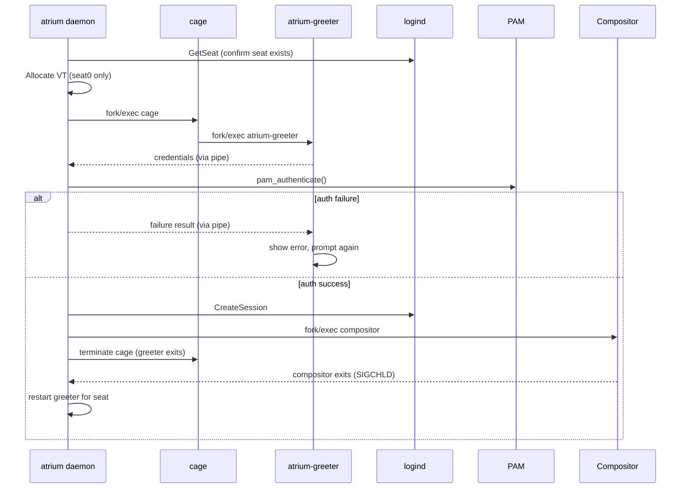
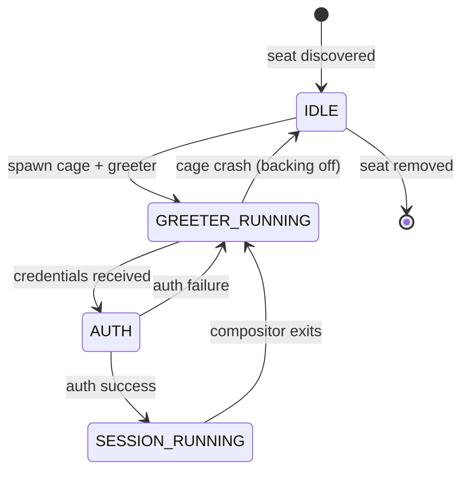

# atrium — Architecture

## What is a Display Manager?

A *display manager* is a system service responsible for managing graphical login
sessions. It runs continuously as a privileged process, presenting a login
interface to users, authenticating them via PAM, registering sessions with the
session manager (logind), and launching the appropriate graphical environment.
Between sessions — and on initial boot — the display manager holds the display
and input devices, preventing unauthorized access to the desktop. Representative
implementations include GDM, SDDM, and LightDM.

Display managers are conventionally split into two components:

- A **daemon** running as root, responsible for privileged operations: seat and
  device management, VT allocation, PAM authentication, logind session
  registration, and compositor launch.
- A **greeter** — an unprivileged process rendering the login UI, isolated from
  the daemon and communicating with it only through a well-defined IPC channel.

## atrium's Goals

atrium aims to be a **simple, correct display manager with first-class multiseat
support**.

Most display managers treat multiseat as an afterthought. atrium is designed from
the ground up around the logind seat model: every seat is a full peer, each seat
gets its own independent greeter and session, and no seat needs special-casing
except `seat0` (which also owns virtual terminals).

Simplicity is a deliberate constraint. atrium targets Linux with systemd/logind
and Wayland compositors only. It makes no attempt to support X11 natively, non-systemd
init systems, or exotic configurations. This scope limitation is what allows the
code to remain readable and the multiseat logic to stay clean.

---

## High-Level Overview

```
┌────────────────────────────────────────────────────────────┐
│ atrium daemon (root)                                       │
│                                                            │
│  poll event loop                                           │
│      │                                                     │
│      ├─ udev events ──> seat discovery / removal           │
│      ├─ D-Bus (sd-bus) <> logind (seats, sessions, VTs)    │
│      ├─ signalfd ──────> SIGCHLD / SIGTERM handling        │
│      └─ pipe fds ──────> greeter IPC (one pair per seat)   │
│                                                            │
│  Per-seat state machine                                    │
│      IDLE → GREETER_RUNNING → AUTH → SESSION_RUNNING       │
│          ↑___________________________|                     │
│                  (session exits → restart greeter)         │
└────────────────────────────────────────────────────────────┘
           │                            │
    fork/exec cage                fork/exec compositor
    (greeter host)                (user session)
           │
    fork/exec atrium-greeter
    (GTK4 login UI)
```

The daemon is a single-threaded event loop built on `poll`. All I/O —
udev hotplug, D-Bus replies, pipe data from greeters, and child-process signals —
arrives through the same loop. There are no threads.

---

## Components

### Event Loop (`src/event.c`)

A thin wrapper around `poll` that maps file descriptors to callback functions.
Every subsystem registers its fds here. The main loop in `src/main.c` calls
`poll` and dispatches to the appropriate handler.

Signals are delivered as fd events via `signalfd`, avoiding async-signal-safety
issues entirely.

### Seat Discovery (`src/seat.c`)

atrium uses `libudev` to enumerate seats at startup and watch for hotplug events.
Each seat maps to a `struct seat` that owns the per-seat state machine.

Seats are identified by their logind seat name (e.g. `seat0`, `seat1`). `seat0`
is the *default* seat: any device not explicitly assigned to another seat via a
udev rule (`ID_SEAT` property) belongs to it. It is also the only seat backed by
the kernel VT subsystem (`/dev/tty1`–`/dev/ttyN`), which predates the seat
concept and is always associated with the primary console — logind maps that to
`seat0` by definition. This is why VT allocation and switching are
`seat0`-only concerns. Additional seats are created by tagging devices with
`ID_SEAT` in udev rules; those seats have no VTs and their display is always
active from logind's perspective.

For each discovered seat the daemon:
1. Queries logind (via D-Bus) to confirm the seat exists.
2. Allocates a VT (seat0 only; see below).
3. Spawns a greeter process.

### Virtual Terminal Management (`src/vt.c`) — seat0 only

Virtual terminals exist only on `seat0`. When a new greeter or user session needs
to start on `seat0`, atrium uses the `VT_OPENQRY` ioctl to find the next free VT
number and allocates it. Each session gets its own VT. When the session exits the
VT is released.

Non-seat0 seats have no VT concept; their display is always active.

### D-Bus / logind Interface (`src/bus.c`)

All logind interaction goes through `sd-bus`. Key operations:

| logind method | When called |
|---|---|
| `GetSeat` | Confirm seat exists on startup |
| `CreateSession` | After successful authentication |
| `ActivateSession` | Switch VT to the new session (seat0) |

The daemon subscribes to logind signals (e.g. `SessionRemoved`) so it can detect
when a session ends and restart the greeter.

For `seat0`, `CreateSession` is called with a non-zero `vtnr` (the VT allocated
above). For all other seats `vtnr` must be 0 — this is enforced with an
`assert()`.

### Greeter Process Lifecycle (`src/greeter.c`)

The greeter is a two-level fork:

1. **cage** — a minimal Wayland compositor (`cage`) is launched first. It owns
   the seat's display devices and provides a Wayland socket.
2. **atrium-greeter** — the GTK4 login UI is launched as a child of cage,
   connecting to cage's Wayland socket.

This design keeps the greeter unprivileged: cage runs with only the permissions
it needs to drive the display hardware, and `atrium-greeter` runs with even fewer.

cage and atrium-greeter are tracked by the daemon; `SIGCHLD` is caught via
`signalfd`. When cage exits (because the user's session was started, or because
of a crash), the daemon detects it and restarts the greeter for that seat.

**Crash-loop detection** in `src/main.c` counts rapid restarts. If a seat's
greeter crashes too many times in a short window, the daemon backs off and logs
an error rather than spinning indefinitely.

### Greeter IPC (`src/greeter.c`, `greeter/main.c`)

The daemon and greeter communicate through a pair of anonymous pipes whose fds
are passed to `atrium-greeter` as command-line arguments at launch.

At a high level:

- The **greeter writes** the user's credentials (username + password) to its end
  of the credential pipe when the user submits the login form.
- The **daemon reads** the credentials, runs PAM authentication, then writes a
  result code (success or failure) back through a second pipe.
- On failure, the greeter displays an error and prompts again.
- On success, the daemon proceeds to create a logind session and launch the
  compositor; the greeter exits.

All pipe fds are created with `O_CLOEXEC` so they are not inherited by the
compositor or any other unrelated child process.

### PAM Authentication (`src/auth.c`)

Authentication is handled via PAM (`libpam`). The daemon drives a PAM
conversation with the credentials received from the greeter. This means the full
PAM stack (password aging, account lockout, MOTD, etc.) applies transparently.

PAM authentication runs synchronously in the daemon process. The event loop is
blocked during authentication. This is acceptable for early versions; a future
phase may move PAM into a worker subprocess if latency becomes a concern.

### Session Handoff

After PAM succeeds:

1. `CreateSession` is called via logind to register the session.
2. The target Wayland compositor is launched (configured per seat/user) as the
   session leader, with the PAM environment applied.
3. The greeter (and cage) are torn down.
4. When the compositor exits (logout, crash), the daemon detects this via
   `SIGCHLD` and restarts the greeter for that seat.

The compositor to launch is configurable per seat. atrium places no constraints
on which Wayland compositor is used — sway, kwin_wayland, or any other are all
valid targets.

---

## Multiseat Specifics

Each seat runs a **fully independent** instance of the greeter and session state
machine. The daemon holds a list of known seats; seat lifecycle events (discovery,
removal, session changes) are scoped to the relevant seat and do not affect others.

Key differences between `seat0` and additional seats:

| | `seat0` | Other seats |
|---|---|---|
| VT allocation | Yes (`VT_OPENQRY`) | No |
| `vtnr` in `CreateSession` | Non-zero | 0 (asserted) |
| Always present | Yes (kernel guarantee) | Discovered via udev |
| Display always on | No (VT switching) | Yes |

---

## Dependencies

| Library | Purpose |
|---|---|
| `libsystemd` (`sd-bus`) | D-Bus communication with logind |
| `libudev` | Seat/device hotplug events |
| `libpam` | User authentication |
| `gtk4` | Greeter UI (`atrium-greeter`) |
| `cage` | Minimal Wayland compositor hosting the greeter |

---

## Login Flow



## Seat Lifecycle


